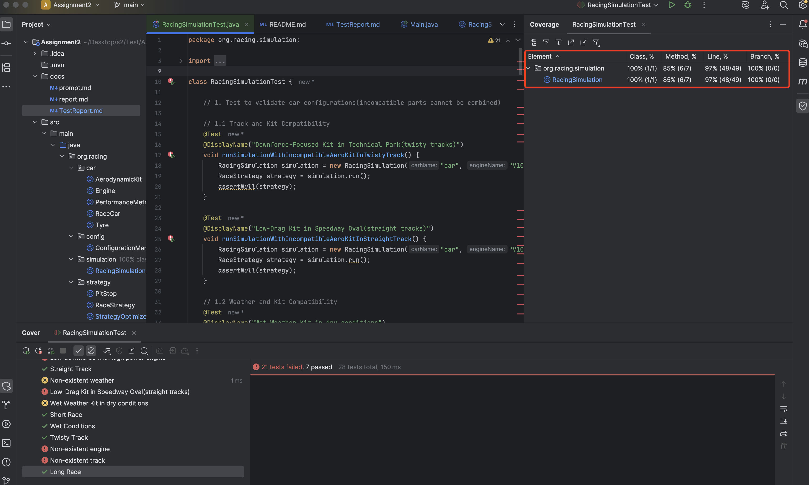

## 1. List of Prompts used to generate the code

### Prompt 1

```
I need reate a java project. Give me a plan with no code about how to do step by step. The specification is following:

# Race Strategy Optimiser and Car Customisation Tool

## Description
You are to build a program that acts as a race team management simulation. The system allows users to customise race cars with different engines, tyres, and aerodynamic features. It also includes a strategy optimiser to plan pit stops, fuel usage, and tyre changes based on race conditions such as track type, weather, and distance.

## Key Features:
1. a Car Customisation:
    - Users can select and upgrade components like engines (e.g., standard, turbocharged),
    - tyres (soft, medium, hard), and aerodynamic kits*(see page 3). Each choice affects performance metrics such as speed, fuel efficiency, and handling.
2. a Race Strategy Optimisation:
    - Users can input race details (track length, weather, fuel capacity, etc.) to generate an optimal pit stop and tyre change strategy for a minimum of 5 race tracks.
    - Your program should take into account factors such as wear rates, and fuel consumption based on the selected car components.

Some details are left open, such as acceleration, fuel tank capacity, and what effect the cornering ability rating has. In this case you are at liberty to decide these details but must include at least 3 variations of each.

1. Standard Kit (Basic Aerodynamics)

    Description: Includes basic front and rear spoilers to reduce drag and provide minimal downforce.

    Performance Impact: Suitable for general-purpose tracks; balances speed and stability without extreme effects.

2. Downforce-Focused Kit

    Description: Features large front splitters and a prominent rear wing to maximise downforce.

    Performance Impact: Improves cornering ability and traction, especially on twisty tracks, but increases drag and reduces top speed.

3. Low-Drag Kit

    Description: Designed with sleek, minimal features to reduce air resistance (e.g., smaller spoilers or absence of a rear wing).

    Performance Impact: Prioritises top speed on long straight tracks but sacrifices cornering stability.

4. Adjustable Aero Kit

    Description: Equipped with adjustable components like movable wings or variable angle splitters.

    Performance Impact: Allows for on-the-fly adjustments to suit different sections of a track-low downforce for straights and high downforce for corners.

5. Ground Effect Kit

    Description: Includes components like underbody diffusers and side skirts to channel airflow underneath the car, creating suction to stick the car to the track.

    Performance Impact: Increases downforce significantly without adding much drag, making it ideal for high-speed tracks.

6. Drag Reduction System (DRS) Kit

    Description: Features a mechanism to temporarily reduce drag by altering aerodynamic components, commonly seen in Formula 1 cars.

    Performance Impact: Allows for better overtaking by boosting straight-line speed when activated.

7. Wet Weather Kit

    Description: Designed for races in wet conditions, with features like extended wheel covers or deflectors to minimise water spray and improve traction.

    Performance Impact: Enhances stability and visibility in rainy conditions, sacrificing some top speed.

8. Hybrid Kit

    Description: Combines elements of low-drag and downforce-focused kits to achieve a middle ground between speed and stability.
    
    Performance Impact: Offers versatility for tracks with a mix of straights and corners.

9. Extreme Aero Kit

    Description: Pushes the limits of aerodynamics with aggressive features like oversized wings, massive splitters, and large diffusers

    Performance Impact: Maximises downforce at the cost of significant drag, ideal for short, technical circuits.


| Aerodynamic Kit| Drag Coefficient(Cd)| Downforce(kg)| Top Speed(km/h)| Fuel Efficiency(km/l)| Cornering Ability(rating out of 10) |
|--|--|--|--|--|--|
|Standard Kit |0.30 |200 |250| 12| 6|
|Downforce-Focussed Kit|0.35| 350 |220| 10 |9|
|Low-Drag Kit| 0.25| 150| 280| 14 |5|
|Adjustable Aero Kit|0.28 - 0.34(variable)|200 - 300(variable)|240 - 260(variable)|11 - 13(variable)|7 - 8(variable)|
|Ground Effect Kit|0.27| 400| 240| 12| 8|
|Drag Reduction System Kit|0.25(activated)|200 |290 (with DRS)|13 |6|
|Wet Weather Kit|0.32| 220| 230| 11 |7|
|Hybrid Kit |0.29 |260 |260 |12 |7|
|Extreme Aero Kit|0.4| 500| 200| 9 |10|
```

### Prompt 2 

At first, create a readme.md document to introduce this project.

### Prompt 3

1. Update the Phase 3 plan, do not use console interface, use configuration file to set the option.
2. Update the Phase 4 plan, do not implement test case, I will implement it independently.
3. Start the Phase 1.
4. Tell me TODO List.

### Prompt 4

yes go on next step

### Prompt 5

Move on the Strategy System

### Prompt 6

Have you finish all Phase? Show me an example how to use the project.

### Prompt 7

I found 2 bugs should be fixed. 1. You should not set all parameters of engine, tyres and aerokit, but only a name of them, and get the attributes from configuration file. 2. I gave you 9 Aerodynamic kits information but you only have 3.

### Prompt 8

You should use my Aerodynamic Kit parameter instead of yours, update the configuration file.

### Prompt 9

You should keep parameters defination be consistent. In configuration file, what the hadling and stability means?

### Prompt 10

You miss fuel efficiency.

### Prompt 11

The program can not be running. Fix it. /opt/homebrew/opt/java/libexec/openjdk.jdk/Contents/Home/bin/java -javaagent:/Applications/IntelliJ IDEA.app/Contents/lib/idea_rt.jar=64713 -Dfile.encoding=UTF-8 -Dsun.stdout.encoding=UTF-8 -Dsun.stderr.encoding=UTF-8 -classpath /Users/zhangsu/Desktop/s2/Test/Assignment2/target/classes:/Users/zhangsu/.m2/repository/com/fasterxml/jackson/core/jackson-databind/2.15.2/jackson-databind-2.15.2.jar:/Users/zhangsu/.m2/repository/com/fasterxml/jackson/core/jackson-annotations/2.15.2/jackson-annotations-2.15.2.jar:/Users/zhangsu/.m2/repository/com/fasterxml/jackson/core/jackson-core/2.15.2/jackson-core-2.15.2.jar org.example.racing.RacingSimulation
Exception in thread "main" java.lang.ClassCastException: class java.util.LinkedHashMap cannot be cast to class com.fasterxml.jackson.databind.JsonNode (java.util.LinkedHashMap is in module java.base of loader 'bootstrap'; com.fasterxml.jackson.databind.JsonNode is in unnamed module of loader 'app')
	at org.example.racing.RacingSimulation.createEngineFromConfig(RacingSimulation.java:63)
	at org.example.racing.RacingSimulation.main(RacingSimulation.java:17)

### Prompt 12

Optimize the track features. 
1. use configuration files to define the track. 
2. Think about how many track should be, and update the track config if you think it is necessary.

### Prompt 13
I delete example path, the project path is src/main/java/org/racing and the configuration path is src/main/resources/config. Now, you need to optimize the track features. 
1. use configuration files to define the track. 
2. Think about how many track should be, and update the track config if you think it is necessary.

### Prompt 14
In the last change, you delete ConfigurationManager.getConfigValue result the program error. And you set 2 repeat track configuration tacks.json and track-config.json. Fix it.

### Prompt 15
I cannot run the RacingSimulation.java. /opt/homebrew/opt/java/libexec/openjdk.jdk/Contents/Home/bin/java -javaagent:/Applications/IntelliJ IDEA.app/Contents/lib/idea_rt.jar=49666 -Dfile.encoding=UTF-8 -Dsun.stdout.encoding=UTF-8 -Dsun.stderr.encoding=UTF-8 -classpath /Users/zhangsu/Desktop/s2/Test/Assignment2/target/classes:/Users/zhangsu/.m2/repository/com/fasterxml/jackson/core/jackson-databind/2.15.2/jackson-databind-2.15.2.jar:/Users/zhangsu/.m2/repository/com/fasterxml/jackson/core/jackson-annotations/2.15.2/jackson-annotations-2.15.2.jar:/Users/zhangsu/.m2/repository/com/fasterxml/jackson/core/jackson-core/2.15.2/jackson-core-2.15.2.jar org.racing.RacingSimulation
Exception in thread "main" java.lang.NullPointerException: Cannot invoke "java.util.Map.get(Object)" because "engineConfig" is null
	at org.racing.RacingSimulation.createEngineFromConfig(RacingSimulation.java:59)
	at org.racing.RacingSimulation.main(RacingSimulation.java:17)

### Prompt 16
/Users/zhangsu/Desktop/s2/Test/Assignment2/src/main/java/org/racing/strategy/StrategyOptimizer.java:47:16
java: constructor RaceStrategy in class org.racing.strategy.RaceStrategy cannot be applied to given types;
  required: double,org.racing.car.Tyre,org.racing.strategy.RaceStrategy.FuelStrategy
  found:    int,int,int[],java.lang.String,java.lang.String
  reason: actual and formal argument lists differ in length

### Prompt 17
/opt/homebrew/opt/java/libexec/openjdk.jdk/Contents/Home/bin/java -javaagent:/Applications/IntelliJ IDEA.app/Contents/lib/idea_rt.jar=49913 -Dfile.encoding=UTF-8 -Dsun.stdout.encoding=UTF-8 -Dsun.stderr.encoding=UTF-8 -classpath /Users/zhangsu/Desktop/s2/Test/Assignment2/target/classes:/Users/zhangsu/.m2/repository/com/fasterxml/jackson/core/jackson-databind/2.15.2/jackson-databind-2.15.2.jar:/Users/zhangsu/.m2/repository/com/fasterxml/jackson/core/jackson-annotations/2.15.2/jackson-annotations-2.15.2.jar:/Users/zhangsu/.m2/repository/com/fasterxml/jackson/core/jackson-core/2.15.2/jackson-core-2.15.2.jar org.racing.RacingSimulation
Exception in thread "main" java.lang.IllegalArgumentException: No enum constant org.racing.car.Engine.EngineType.TURBO
	at java.base/java.lang.Enum.valueOf(Enum.java:293)
	at org.racing.car.Engine$EngineType.valueOf(Engine.java:14)
	at org.racing.RacingSimulation.createEngineFromConfig(RacingSimulation.java:67)
	at org.racing.RacingSimulation.main(RacingSimulation.java:19)

Process finished with exit code 1

### Prompt 18

In RacingSimulation.java, create a simulation method in which user can set necessary parameter. And in main mthod, you should call the simulation method. Simulation method should be testable.

### Prompt 19

You should consider code structure, move SimulationResult to a new file. And write the command what parameter can I set.


## 2. Documentation of unit test caases

test case : src/test/java/org/racing/simulation/RacingSimulationTest.java

### iii Document the outcome of each test case.

| Test Type | Test Case | Configuration | Result |
|-----------|-----------|---------------|--------|
| **1. Test to validate car configurations** |
| | Downforce-Focused Kit in Technical Park | - Engine: V10<br>- Tyre: Soft Compound<br>- Kit: Downforce-Focussed<br>- Track: Technical Park<br>- Weather: DRY | Failed |
| | Low-Drag Kit in Speedway Oval | - Engine: V10<br>- Tyre: Soft Compound<br>- Kit: Low-Drag<br>- Track: Speedway Oval<br>- Weather: DRY | Failed |
| | Wet Weather Kit in dry conditions | - Engine: Turbo V6<br>- Tyre: Soft Compound<br>- Kit: Wet Weather<br>- Track: Technical Park<br>- Weather: DRY | Failed |
| | Standard Kit in wet conditions | - Engine: Turbo V6<br>- Tyre: Soft Compound<br>- Kit: Standard<br>- Track: Technical Park<br>- Weather: WET | Failed |
| | High downforce with low power engine | - Engine: Turbo V6<br>- Tyre: Medium Compound<br>- Kit: Downforce-Focussed<br>- Track: Technical Park<br>- Weather: DRY | Pass |
| | High downforce with high power engine | - Engine: V10<br>- Tyre: Soft Compound<br>- Kit: Downforce-Focussed<br>- Track: Speedway Oval<br>- Weather: DRY | Failed |
| | Low downforce with high power engine | - Engine: V10<br>- Tyre: Medium Compound<br>- Kit: Low-Drag<br>- Track: Technical Park<br>- Weather: DRY | Failed |
| | Low downforce with low power engine | - Engine: V10<br>- Tyre: Medium Compound<br>- Kit: Low-Drag<br>- Track: Technical Park<br>- Weather: DRY | Failed |
| | Hard Compound in wet conditions | - Engine: Turbo V6<br>- Tyre: Hard Compound<br>- Kit: Wet Weather<br>- Track: Technical Park<br>- Weather: WET | Failed |
| | Soft Compound in high-speed track | - Engine: V10<br>- Tyre: Soft Compound<br>- Kit: Low-Drag<br>- Track: Speedway Oval<br>- Weather: DRY | Failed |
| **2. Test strategy outcomes under various race scenarios** |
| | Dry Conditions | - Engine: V10<br>- Tyre: Soft Compound<br>- Kit: Standard<br>- Track: Coastal Run<br>- Weather: DRY | Pass |
| | Wet Conditions | - Engine: V10<br>- Tyre: Soft Compound<br>- Kit: Standard<br>- Track: Coastal Run<br>- Weather: WET | Pass |
| | Short Race | - Engine: V10<br>- Tyre: Soft Compound<br>- Kit: Standard<br>- Track: Coastal Run<br>- Weather: DRY | Failed |
| | Long Race | - Engine: V10<br>- Tyre: Soft Compound<br>- Kit: Standard<br>- Track: Coastal Run<br>- Weather: DRY | Pass |
| | Twisty Track | - Engine: V10<br>- Tyre: Soft Compound<br>- Kit: Standard<br>- Track: Technical Park<br>- Weather: DRY | Pass |
| | Straight Track | - Engine: V10<br>- Tyre: Soft Compound<br>- Kit: Standard<br>- Track: Speedway Oval<br>- Weather: DRY | Pass |
| **3. Test for edge cases** |
| | Negative fuel | - Engine: V10<br>- Tyre: Soft Compound<br>- Kit: Standard<br>- Track: Coastal Run<br>- Fuel: -1 | Failed |
| | Negative laps | - Engine: V10<br>- Tyre: Soft Compound<br>- Kit: Standard<br>- Laps: -1 | Failed |
| | Non-existent engine | - Engine: non-existent<br>- Tyre: Soft Compound<br>- Kit: Standard | Failed |
| | Non-existent tyre | - Engine: V10<br>- Tyre: non-existent<br>- Kit: Standard | Failed |
| | Non-existent aero kit | - Engine: V10<br>- Tyre: Soft Compound<br>- Kit: non-existent | Failed |
| | Non-existent track | - Engine: V10<br>- Tyre: Soft Compound<br>- Track: non-existent | Failed |
| | Non-existent weather | - Engine: V10<br>- Tyre: Soft Compound<br>- Weather: null | Failed |
| **4. Test multiple races to test the accuracy and consistency** |
| | Race 1 (Technical Park) | - Engine: V10<br>- Tyre: Soft Compound<br>- Kit: Standard<br>- Track: Technical Park | Failed |
| | Race 2 (Speedway Oval) | - Engine: V10<br>- Tyre: Soft Compound<br>- Kit: Standard<br>- Track: Speedway Oval | Failed |
| | Race 3 (Mountain Pass) | - Engine: V10<br>- Tyre: Soft Compound<br>- Kit: Standard<br>- Track: Mountain Pass | Failed |
| | Race 4 (City Circuit) | - Engine: V10<br>- Tyre: Soft Compound<br>- Kit: Standard<br>- Track: City Circuit | Failed |
| | Race 5 (Coastal Run) | - Engine: V10<br>- Tyre: Soft Compound<br>- Kit: Standard<br>- Track: Coastal Run | Failed |


### iv. Indicate the coverage of the test cases written.



As the snapshot show, Method Coverage is 85% and Line Coverage is 97%.

## Final Recommendations

I strongly do not recommend using AI for coding work. The 95% code in this project was generated by claude-3.7 in Cursor. I meet with a lot of bugs although I used best product of AI programming, 

0. Feature Bugs

    The error reported to AI cannot be always fixed. In my project, I try many times to provide logs and error information ask AI fix the logic error of incorrect fuel capacity and strategy calculation, but it don't work.

1. Miss Information

    Sometimes AI can not get all information especially your prompt is long content. For example, in prompt 1, I give AI all kits infomation but it create 3/9 kits.

2. Hallucinations

    AI frequently generate redundant and useless attributes. For example, the attributes like 'weight' and 'price' in data entity of all components are not required in my prompt but AI created it.

3. Parameter Name Inconsistency

    The parameter names in the entity class do not match those in the configuration file, which may lead to misunderstanding.

4. Interface-Configuration Mismatch

    When I report bugs in parameter inconsistency, the AI only fix configuration but the interface has not been fixd which leads to program running error.

5. Configuration Module Interface Inconsistency

    I report same bugs in prompt 7 and prompt 13 to deal with a problem that the entity should be load by configurations. But I get 2 style interface of loading configuration.

    The engine, tyres and aerokit use customized method in RacingSimulation, and track use a standard config read method.

    The problem reduced code quality and readability.
    ```
    public class RacingSimulation {
        private static final ConfigurationManager configManager = ConfigurationManager.getInstance();

        public static void main(String[] args) {
            // Create a race car with components from configuration
            Engine engine = createEngineFromConfig("Turbo V6");
            Tyre tyres = createTyreFromConfig("Soft Compound");
            AerodynamicKit aeroKit = createAeroKitFromConfig("Standard Kit");

            RaceCar raceCar = new RaceCar("Speed Demon", engine, tyres, aeroKit);

            // Load track from configuration
            Track track = configManager.loadTrack("Technical Park");
    ...
    ```

6. Iteration Requirements

    AI cannot manage iteration requirements. The expired code and file cannot be properly processed.
    
    For example. In prompt 13, AI update interface about how to create a track. But a new configuration file 'track.json' was created, which is almost same as 'track-config.json'. Then in prompt 14, I report the issue but AI give no response to me. Finally, the two repeat track configuration 'tracks.json and 'track-config.json' exist in the project. In fact, the expired 'track-config.json' should be deleted, and 'tracks.json' should have same named style of other configuration files.