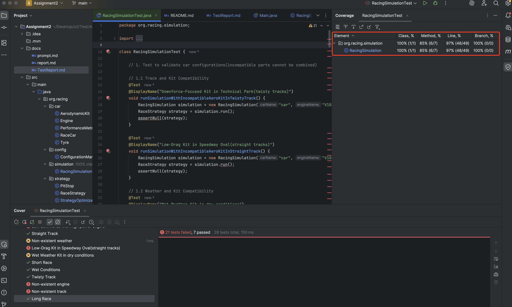

## III. Document the outcome of each test case.

| Test Type | Test Case | Configuration | Result |
|-----------|-----------|---------------|--------|
| **1. Test to validate car configurations** |
| | Downforce-Focused Kit in Technical Park | - Engine: V10 - Tyre: Soft Compound - Kit: Downforce-Focussed - Track: Technical Park - Weather: DRY | Failed |
| | Low-Drag Kit in Speedway Oval | - Engine: V10 - Tyre: Soft Compound - Kit: Low-Drag - Track: Speedway Oval - Weather: DRY | Failed |
| | Wet Weather Kit in dry conditions | - Engine: Turbo V6 - Tyre: Soft Compound - Kit: Wet Weather - Track: Technical Park - Weather: DRY | Failed |
| | Standard Kit in wet conditions | - Engine: Turbo V6 - Tyre: Soft Compound - Kit: Standard - Track: Technical Park - Weather: WET | Failed |
| | High downforce with low power engine | - Engine: Turbo V6 - Tyre: Medium Compound - Kit: Downforce-Focussed - Track: Technical Park - Weather: DRY | Pass |
| | High downforce with high power engine | - Engine: V10 - Tyre: Soft Compound - Kit: Downforce-Focussed - Track: Speedway Oval - Weather: DRY | Failed |
| | Low downforce with high power engine | - Engine: V10 - Tyre: Medium Compound - Kit: Low-Drag - Track: Technical Park - Weather: DRY | Failed |
| | Low downforce with low power engine | - Engine: V10 - Tyre: Medium Compound - Kit: Low-Drag - Track: Technical Park - Weather: DRY | Failed |
| | Hard Compound in wet conditions | - Engine: Turbo V6 - Tyre: Hard Compound - Kit: Wet Weather - Track: Technical Park - Weather: WET | Failed |
| | Soft Compound in high-speed track | - Engine: V10 - Tyre: Soft Compound - Kit: Low-Drag - Track: Speedway Oval - Weather: DRY | Failed |
| **2. Test strategy outcomes under various race scenarios** |
| | Dry Conditions | - Engine: V10 - Tyre: Soft Compound - Kit: Standard - Track: Coastal Run - Weather: DRY | Pass |
| | Wet Conditions | - Engine: V10 - Tyre: Soft Compound - Kit: Standard - Track: Coastal Run - Weather: WET | Pass |
| | Short Race | - Engine: V10 - Tyre: Soft Compound - Kit: Standard - Track: Coastal Run - Weather: DRY | Failed |
| | Long Race | - Engine: V10 - Tyre: Soft Compound - Kit: Standard - Track: Coastal Run - Weather: DRY | Pass |
| | Twisty Track | - Engine: V10 - Tyre: Soft Compound - Kit: Standard - Track: Technical Park - Weather: DRY | Pass |
| | Straight Track | - Engine: V10 - Tyre: Soft Compound - Kit: Standard - Track: Speedway Oval - Weather: DRY | Pass |
| **3. Test for edge cases** |
| | Negative fuel | - Engine: V10 - Tyre: Soft Compound - Kit: Standard - Track: Coastal Run - Fuel: -1 | Failed |
| | Negative laps | - Engine: V10 - Tyre: Soft Compound - Kit: Standard - Laps: -1 | Failed |
| | Non-existent engine | - Engine: non-existent - Tyre: Soft Compound - Kit: Standard | Failed |
| | Non-existent tyre | - Engine: V10 - Tyre: non-existent - Kit: Standard | Failed |
| | Non-existent aero kit | - Engine: V10 - Tyre: Soft Compound - Kit: non-existent | Failed |
| | Non-existent track | - Engine: V10 - Tyre: Soft Compound - Track: non-existent | Failed |
| | Non-existent weather | - Engine: V10 - Tyre: Soft Compound - Weather: null | Failed |
| **4. Test multiple races to test the accuracy and consistency** |
| | Race 1 (Technical Park) | - Engine: V10 - Tyre: Soft Compound - Kit: Standard - Track: Technical Park | Failed |
| | Race 2 (Speedway Oval) | - Engine: V10 - Tyre: Soft Compound - Kit: Standard - Track: Speedway Oval | Failed |
| | Race 3 (Mountain Pass) | - Engine: V10 - Tyre: Soft Compound - Kit: Standard - Track: Mountain Pass | Failed |
| | Race 4 (City Circuit) | - Engine: V10 - Tyre: Soft Compound - Kit: Standard - Track: City Circuit | Failed |
| | Race 5 (Coastal Run) | - Engine: V10 - Tyre: Soft Compound - Kit: Standard - Track: Coastal Run | Failed |

## IV. Indicate the coverage of the test cases written.

As the snapshot show, Method Coverage is 85% and Line Coverage is 97%.